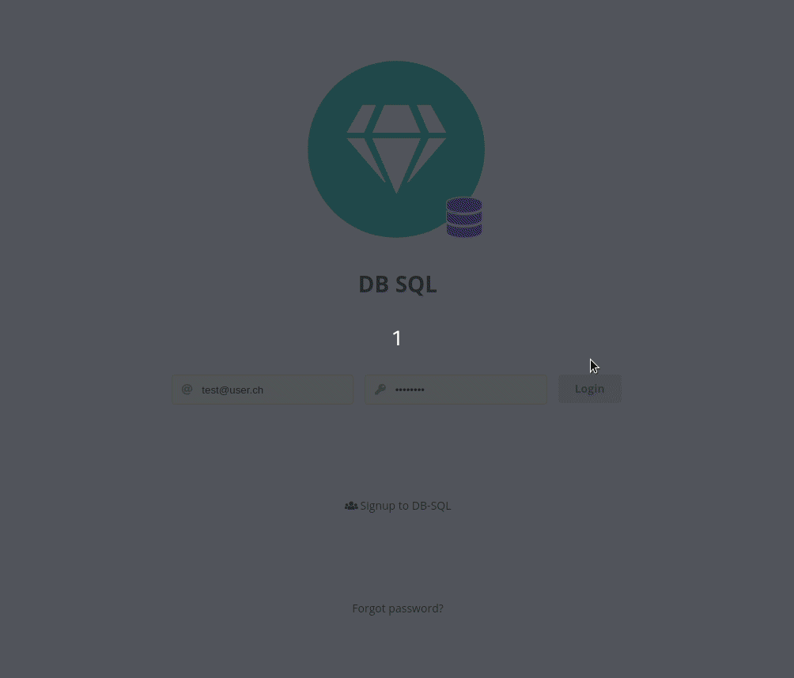

[](https://travis-ci.com/lebalz/db-sql)
[](https://codecov.io/gh/lebalz/db-sql)

# [DB-SQL](https://db-sql.ch)


Try it out: [db-sql.ch](https://db-sql.ch)

## Setup

### PreRequirements
- Ruby v2.6.2
- bundler `gem install bundler`
- [Yarn](https://yarnpkg.com/en/docs/install)

### Install

1. `EDITOR=nano rails credentials:edit` and set the [env variables](#env-variables)
2. `yarn install`
3. `bundle`
4.  (on first time setup, see [configure postgres](#configure-postgres))
5. `rails db:setup`

In development, `rails db:setup` will seed a default user `rails db:seed` with the password `asdfasdf` and some db connections for this user.
To customize your seeds, see [Custom Seeds](#custom-seeds)

To reseed, run
```sh
bundle exec rails db:drop db:setup
```

### ENV Variables
| Key                      | example                | ENV                 |
|:-------------------------|:-----------------------|:--------------------|
| RAILS_MASTER_KEY         | `config/master.key`(1) | production, staging |
| DB_SQL_DATABASE_USER     | postgres               | development, test   |
| DB_SQL_DATABASE_PASSWORD | ""                     | development, test   |
| SENDGRID_USERNAME        | apikey                 | development         |
| SENDGRID_API_KEY         |                        | development         |
| RAILS_SERVE_STATIC_FILES | `true` (2)             | production, staging |

1. `config/master.key` will be created automatically when calling `rails credentials:edit`. It must not be set in development. Copy this value to your deploy server and set the value from your local `master.key`. Make sure you don't version control `master.key`. See [this blog](https://medium.com/cedarcode/rails-5-2-credentials-9b3324851336) for more about rails credentials.

2. Currently `RAILS_SERVE_STATIC_FILES` is set to `true` on the dokku host to enable serving of static assets. This could lead to bad performance and could be optimized through cdns or volume in the container and serving the assets by nginx.

## DB-SQL Concepts
- [Security concepts](docs/security_concepts.md)

## Start Rails

Rails is expected to run on port `3000`. Start it with
```sh
bundle exec rails start
```
and visit [http://localhost:3000](http://localhost:3000)

### Webpacker

To use webpacker, start it with

```sh
bin/wepacker-dev-server
```

### configure postgres

To create a new postgres user for this project:
```sh
sudo -u postgres psql
postgres=# CREATE USER foo WITH ENCRYPTED PASSWORD 'bar';
postgres=# ALTER ROLE foo WITH superuser;
```

If pgcrypto is not installed for a database, install it to the public schema:
```sh
$ sudo -u postgres psql
postgres=# CREATE EXTENSION IF NOT EXISTS "pgcrypto" SCHEMA public;
```

### Custom Seeds

If you need for development custom seeds of DbServers with confidential credentials, then create a new File `seed_db_servers.yaml` in root:

```sh
cp seed_db_servers.example.yaml seed_db_servers.yaml
```
edit it to your needs and reseed.

The fields `db_initial_db` and `db_initial_table` ar optional.


## Mailing

In production [Sendgrid](https://sendgrid.com) is used to send mails. Set your credentials with `rails credentials:edit` to work with sendgrid. You find your API Keys in Sendgrid under `API Keys > Create API Key > Full Access`.

# Development

## Swagger

The project uses a grape api and supports swagger ui. It expects rails to running on port `3000` and that the user `test@user.ch` with password `asdfasdf` is seeded.

```sh
node swagger_ui.js
```

will start swagger on [http://localhost:4000](http://localhost:4000).


## Generate Documentation

Run `bin/generate_docs`. This will generate the documentation of the rails models, located at `./doc/`.

## Testing
Requirements:
- [docker](https://docs.docker.com/engine/install/)
- [docker-compose](https://docs.docker.com/compose/install/)

Docker compose is for the integration tests to start mysql and psql databases with different versions each. [spec/docker-compose.yml](spec/docker-compose.yml) is used to start up the databases used within the specs. The [rails_helper.rb](spec/rails_helper.rb) is responsible to start and stop the containers for integration and feature tests.

Run the tests with

```sh
bundle exec rspec
```

The startup time can be reduced when the docker containers are not started and stopped on each test run. To skip the shutting down of the containers after the test, run

```sh
KEEP_DBS_RUNNING=1 bundle exec rspec
```

To start/stop the containers manually, run

```sh
# starting containers
rake db:start_spec_dbs

# stopping containers
rake db:stop_spec_dbs
```

### Mails in Development

Use the mailcatcher gem to receive emails in development: `bundle exec mailcatcher`.
Mails sent with `:smtp` to [http://localhost:1025](http://localhost:1025) are catched by mailcatcher and can be seen in the inbox at [http://localhost:1080](http://localhost:1080).


## Deploy

The app can be deployed with dokku (thorough the usage of this [Dockerfile](Dockerfile)).

To deploy db-sql on a dokku-instance, you can run

```sh
SSH_USER=root IP=<DOKKUS_IP> ./setup_dokku.sh
```

to easyly

- install needed Plugins (postgres and letsencrypt)
- setup the needed env variables
- deploy the app
- letsencrypt the connection

### ENV variables on production

Set the all [ENV variables](#env-variables) through `dokku config:set <app-name> <ENV_VAR_NAME>=<ENV_VAR_VALUE>`

### Letsencrypt
See [this post](https://github.com/dokku/dokku-letsencrypt#dockerfile-deploys) to see how to configure letsencrypt
